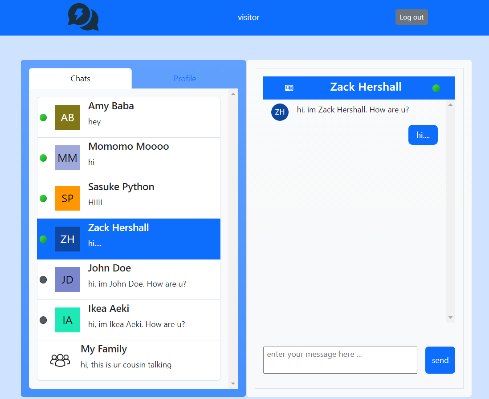

# MessageMe Messenger / Odin-Message-App
- An full-stack web application for users to send message to each other , this is part of projects built along TheOdinProject Course.

- Tech Stack :
  1. FrontEnd (Vite + React + React Router + Bootstrap)
  2. BackEnd (Node + Express + PostgreSQL + Prisma)

# Intallation (BE) :
1. npm install
2. add .env file
    - add DATABASE_URL = \<your postgresSQL connection string>
    - add JWT_SECRET_KEY = \<your secret key>
3. npx prisma migrate dev
4. npm run resetDB
5. npm run serverstart , enjoy locally  at http://localhost:3000/

** Jest + SuperTest Tests are available @npm run test

# Installation (FE):
1. pre - Host the backend locally at http://localhost:3000 
2. pre - update API_URL inside  /layout/API_URL.jsx , or the URL to ur actual hosted IP.
3. npm install
4. npm run dev

# Live demo :
- FrontEnd : https://wongyc-66.github.io/odin-messaging-app-FE/
- BackEnd : https://odin-messaging-app-be.adaptable.app

# Source:
- FE : https://github.com/WongYC-66/odin-messaging-app-FE
- BE : https://github.com/WongYC-66/odin-messaging-app-BE

